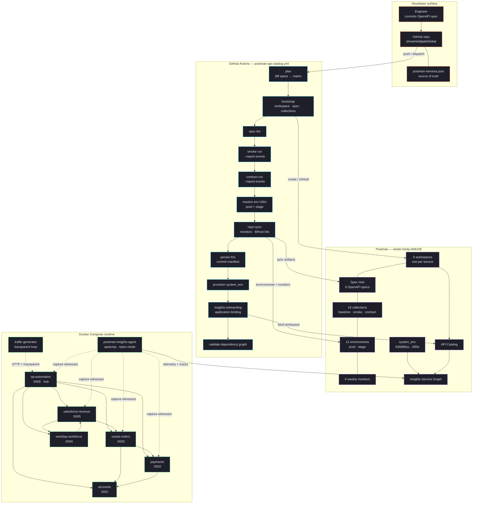
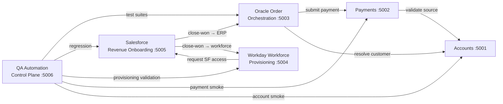

# Postman API Catalog Pipeline — Jade Global

This folder contains a repo-ready GitHub Actions design for onboarding and maintaining OpenAPI-backed services in Postman without creating duplicate APIs or collections.

It is intentionally **Spec Hub only**. The sample does not use Postman API Builder commands or API-version publish commands.

## Architecture overview

End-to-end flow from source repo through CI/CD into the Postman API Catalog and Insights Service Graph, with a Docker Compose runtime emitting W3C `traceparent`-instrumented traffic captured by the Insights agent.



### Service dependency graph

11 directed edges across 6 services. QA fans out to all five upstreams; Salesforce ↔ Workday is bidirectional; Oracle calls Payments + Accounts; Payments calls Accounts.



### Postman team mapping

| Service | Workspace ID | Domain | Port |
| --- | --- | --- | --- |
| payments-api | `8960dba5-85f9-43ff-806f-adb2b76fb056` | AF · Core Banking | 5002 |
| accounts-api | `2e09cc35-4e20-41cd-b487-c1215eeefab4` | AF · Core Banking | 5001 |
| oracle-order-orchestration-api | `70b40ffa-e0e0-41ab-bad5-9da4acf4fb6a` | EI · ERP Integration | 5003 |
| salesforce-revenue-onboarding-api | `06014741-03c9-4784-b463-3608ab4a3892` | RO · Revenue Ops | 5005 |
| workday-workforce-provisioning-api | `f0461107-3973-42d5-b301-640a9637694e` | WM · Workforce Mgmt | 5004 |
| qa-automation-control-plane-api | `080d0acc-d899-44d2-8fe1-fc1356aba02e` | QA · Automation | 5006 |

Team: **winter-trinity-948108** · Team ID: **13569807** · System env: **`936898ce-cf73-4feb-827e-8a0e9d5e695e`**

## Files

- `.github/workflows/postman-api-catalog.yml`: main pipeline
- `postman-services.json`: per-service source of truth for spec paths, runtime URLs, previously created Postman IDs, dependency graph, and Insights configuration
- `ARCHITECTURE.md`: Spec Hub-only sequence, idempotency controls, self-bootstrapping model, dependency graph, and Insights integration

## Action mapping

- `postman-cs/postman-bootstrap-action@v0`: first-class bootstrap step for workspace, spec, and collection creation or refresh
- `postman-cs/postman-repo-sync-action@v0`: syncs repo state, creates environments, and publishes Bifrost-backed repo linkage after validation
- `postman-cs/postman-insights-onboarding-action@v0`: onboards services with `enable_insights: true` into the Insights Service Graph using the shared system environment
- `postman-cs/postman-api-onboarding-action@v0`: referenced for the same action family, but intentionally not wired into the workflow so the Spec Hub path stays explicit and transparent
- `postman-cs/postman-aws-spec-discovery-action`: recommended as an upstream discovery workflow that writes newly found specs back into the repo before this pipeline runs

## Operating model

1. Keep `postman-services.json` under version control.
2. Store stable `workspace_id`, `spec_id`, and collection IDs after first successful onboarding.
3. Let pull requests run validation against changed services only.
4. Let `main` push runs promote the validated Spec Hub assets through bootstrap, repo sync, and Insights onboarding.

## Self-bootstrapping

No static UUIDs need to be filled in before first run. The pipeline creates everything it needs:

1. **Bootstrap** creates the workspace, Spec Hub spec, and collections (or refreshes them using IDs already in the manifest).
2. **Repo sync** creates prod and stage environments and returns their UIDs.
3. **System environment provisioning** creates the Production system environment via the Postman API on the first run, then stores the UUID.
4. **Insights onboarding** uses the system environment to register each service in the Service Graph.
5. **`persist_ids` job** commits the newly created `system_env` UUID back to `postman-services.json` and the environment files on `main` pushes, so subsequent runs and Kubernetes deployments can reference it.

After the first successful `main` push, `system_env` in the manifest is populated and all future runs reuse it.

## Dependency graph

The manifest defines inter-service relationships at two levels:

- **`dependency_graph.edges`**: top-level array of `{ from, to, relationship }` objects describing the full service graph.
- **Per-service `dependencies`**: each service entry carries a `dependencies` array referencing the `service_key` values of services it calls.

The CI pipeline validates that every dependency target exists in the manifest and has Insights enabled.

### Current graph

```
qa-automation-control-plane-api ──▶ oracle-order-orchestration-api
qa-automation-control-plane-api ──▶ salesforce-revenue-onboarding-api
qa-automation-control-plane-api ──▶ workday-workforce-provisioning-api
qa-automation-control-plane-api ──▶ payments-api
qa-automation-control-plane-api ──▶ accounts-api
oracle-order-orchestration-api  ──▶ payments-api
oracle-order-orchestration-api  ──▶ accounts-api
salesforce-revenue-onboarding-api ──▶ oracle-order-orchestration-api
salesforce-revenue-onboarding-api ──▶ workday-workforce-provisioning-api
workday-workforce-provisioning-api ──▶ salesforce-revenue-onboarding-api
payments-api                    ──▶ accounts-api
```

All 6 services share `jade-global-cluster` and a single auto-provisioned system environment (`936898ce-cf73-4feb-827e-8a0e9d5e695e`).

## Insights Service Graph integration

The dependency graph appears as edges in Postman API Catalog once live traffic flows through instrumented services:

1. **System environment** is created automatically by the pipeline on the first run — no manual setup required.
2. **Both services have Insights enabled** (`enable_insights: true`) and share the same cluster.
3. **The DaemonSet** must be deployed with `--repro-mode` in the `postman-insights-namespace` (see `TRACE_HEADERS_RUNBOOK.md`).
4. **`hostNetwork: true`** and `dnsPolicy: ClusterFirstWithHostNet` must be set on all service pods.
5. **`traceparent` headers** are propagated on all inter-service HTTP calls (already wired into Smoke and Contract collections).
6. **Live traffic** must flow — the graph is built from captured traces, not static config.

### Traceparent in collections

All Smoke and Contract collections auto-generate W3C `traceparent` headers via a collection-level pre-request script. When collection runs execute against services behind the Insights DaemonSet, the agent captures the trace context and correlates edges between services.

## Build outputs

- `reports/<service>-lint.txt`: governance and syntax output from `postman spec lint`
- `reports/<service>-smoke.txt`: console output from smoke runs
- `reports/<service>-smoke.junit.xml`: JUnit report for CI test reporting
- `reports/<service>-smoke.json`: JSON report for downstream processing
- `reports/<service>-contract.txt`: console output from contract runs
- `reports/<service>-contract.junit.xml`: JUnit report for contract verification
- `reports/<service>-contract.json`: JSON report for downstream processing

Contract or smoke test failures return a non-zero exit code from `postman collection run`, so the job fails without any extra failure wrapper.

## Required secrets and variables

- `POSTMAN_API_KEY`
- `POSTMAN_ACCESS_TOKEN`
- `GH_FALLBACK_TOKEN`
- `POSTMAN_WORKSPACE_ADMIN_USER_IDS` as a repo or org variable
- `POSTMAN_ORG_MODE` as an optional repo or org variable

## Why this avoids duplicates

- The manifest carries stable per-service Postman IDs.
- Bootstrap reuses those IDs when present instead of creating fresh assets.
- The workflow processes only changed services, which limits accidental replays.
- Concurrency is serialized per git ref to reduce overlapping writes.

## AWS spec discovery

This workflow references `postman-aws-spec-discovery-action` as the feeder stage, but it is intentionally kept upstream from the Spec Hub sync workflow. The cleanest pattern is:

1. Scheduled discovery workflow runs the AWS action.
2. It commits discovered or refreshed OpenAPI specs into `openapi/`.
3. That commit triggers `postman-api-catalog.yml`.
